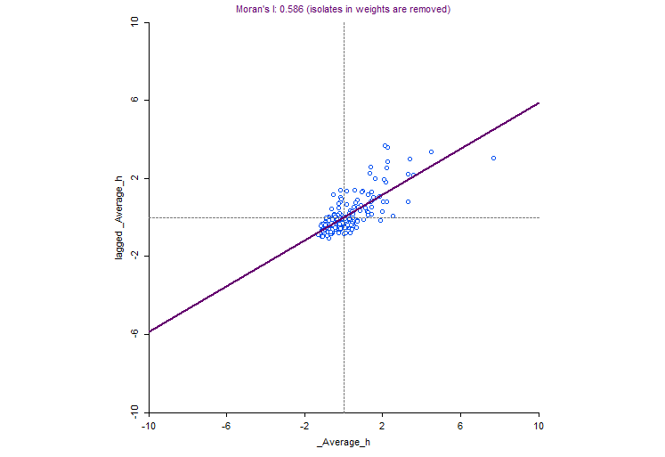

# Spatial Analysis of Income Distribution in Sweden (2009)

## Project Overview
This study explores the geographic distribution of average income across Swedish municipalities using data from 2009. The analysis aims to determine whether wealth is distributed randomly or if it exhibits significant spatial patterns such as clustering.

## Key Results
The analysis confirms that income in Sweden is **not randomly distributed**. Instead, it shows a clear spatial configuration where municipalities with similar income levels cluster together.

### 1. Global Spatial Autocorrelation (Moran's I)
Using a Queen contiguity weights matrix, the Global Moran's I test yielded the following results:
* **Moran's I Value**: 0.5863 (indicating strong positive spatial autocorrelation).
* **Z-statistic**: 15.7461.
* **Pseudo p-value**: 0.001.

Since the p-value is strictly lower than 0.01, we reject the null hypothesis of randomness at the **1% significance level**.

### 2. Local Spatial Patterns (Hot Spots & Cold Spots)
The analysis identified significant wealth clusters using the Getis-Ord $Gi^{*}$ statistic:

* **Hot Spots (High Income)**: Predominantly concentrated in the **Stockholm metropolitan area** and the southern region of **Scania (Skåne)**.
* **Cold Spots (Low Income)**: Mainly located in the **northern interior** and **central-western regions** of Sweden.

---

## Visualizations

### Income Hotspot Map

*Figure 1: Statistically significant clusters of high (red) and low (blue) income.*

### Moran's I Scatter Plot

*Figure 2: Visual representation of the global spatial autocorrelation.*

---

## Data and Methodology
* **Software**: Geospatial analysis performed using **QGIS** for mapping and **GeoDa** for spatial statistics.
* **Spatial Weights**: Queen contiguity matrix.
* **Dataset**: Includes 290 Swedish municipalities with average income data from 2009.
